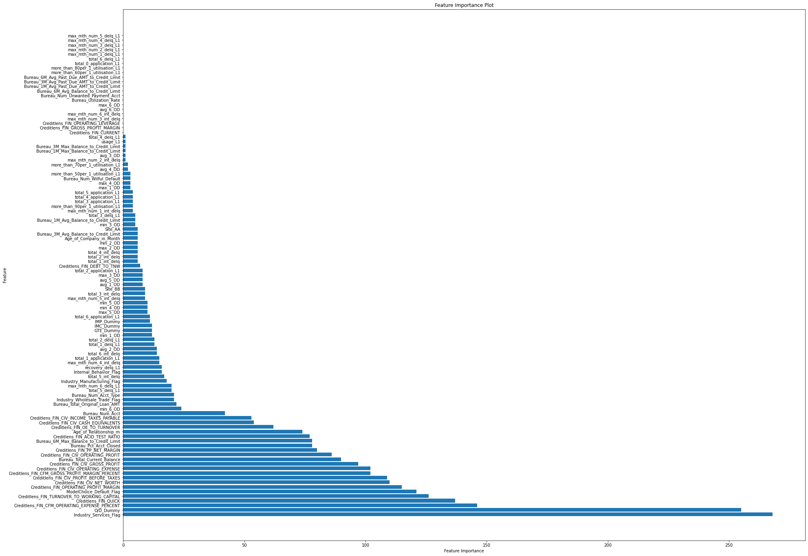

# CreditDefault-Prediction
# 0. DataSource Description
  The data comes from the data set shared by HSBC Guest for the second time. The theme is to predict the loan default of a company based on its financial, internal behavior and other data.  
    
# 1. DataAnalysis and Processing
## 1.1 Category Analysis via DataDictionary_V1.xlsx(1 Object and 104 int64/float64)
  There are three main modules: Bureau, Internal Behavior, and Financial, each module has more than 30 features.   
  There are 5 Segment features: Site, Age_of_Company_in_Month, Industry_Manufacturing_Flag, Industry_Wholesale_Trade_Flag, Industry_Services_Flag.  
    
    
## 1.2 NAN Analysis via Transformed_data_v1.0_final.csv
  There are 75/105 features with missing values. Through the histogram and data description of DataDictionary_V1.xlsx below, we know that many of the features are limited to a certain segment.  
    
## 1.3 Sample Imbalance Analysis and data split 8:2 via y Label
  I divided the training set and test set according to the ratio of 8:2 through label, and through the histogram below, we can see that the samples are extremely unbalanced.  
    
## 1.4 Data Processing
Based on the above data analysis, we can perform the following data processing work
* **Drop CustomerID**: Since Drop CustomerID has no actual meaning, it is easy to add noise to model training, and the tree model will produce many split points. we will delete it
* **Nan filling with mean value**: We use the mean filling method.
* **Upsampling**: We use RandomOverSampler to upsample samples with label 1, which alleviates the sample imbalance problem to a certain extent.
* **'Site' One-hot Encoding**: Since the Site variable is an Object type feature, it contains 3 categories. It contains additional information, which we one-hot encode.
* **Segment Integration**: First Convert the Age_of_Company_in_Month segment feature into a categorical feature. Second, the values of the five segment features are synthesized to obtain a new segment feature "Integrated_segments", which is used to uniquely identify which segment a sample belongs to.
# 2. BenchMark Model
## 2.1 Logistic Model
    
## 2.2 LightGBM Model
    
| BenchMark Model\Evaluation index | AUC_Validation | AUC_Test    | Accuracy    | Recall      | Precision   | F1-score    |
|----------------------------------|----------------|-------------|-------------|-------------|-------------|-------------|
| Logistic Regression              | 0.724168589    | 0.679795904 | 0.73584242  | 0.524271845 | 0.071428571 | 0.12572759  |
| LightGBM                         | 0.997240439    | 0.771327333 | 0.931058741 | 0.300970874 | 0.2         | 0.240310078 |

## 2.3 LGB parameter Optimization via Optuna(An open-source framework for automated hyperparameter optimization)
I used optuna to search and adjust parameters such as 'num_leaves', 'learning_rate', 'max_depth', and 'n_estimators', and experimented 100 times.  
The optimal parameters obtained are as follows: Best params: {'num_leaves': 151, 'learning_rate': 0.04953824530034172, 'max_depth': 9, 'n_estimators': 713}  
The parameters and indicators are as follows:  
| BenchMark Model\Evaluation index | AUC_Validation | AUC_Test    | Accuracy    | Recall      | Precision   | F1-score    |
|----------------------------------|----------------|-------------|-------------|-------------|-------------|-------------|
| LightGBM_Optuna                  | 0.999805349    | 0.730986464 | 0.966232853 | 0.145631068 | 0.652173913 | 0.238095238 |
## 2.4 Feature Importance Analysis
The last 10% of features have little effect on model training and can be considered to be deleted directly in the future.  
    
# 3. New Model Structure
## 3.1 Structure Introduction
Last time, an HSBC customer shared the method of vertical module modeling and horizontal segment modeling. I was very interested. After the class, I had an in-depth exchange with him and learned a new modeling method that combines modules and segments. Here I made my attempt at modeling. 
Specifically, from a vertical perspective, based on module modeling, we can train three models on this data set. After each model is trained, it can predict the probability of default of each sample, so that each sample can get three new features predicted by the model. Then we model based on the segment horizontally, use the three new features just output by the vertical model for modeling training, and finally make predictions.  
In the code, I wrote a **StackModel class** to implement this modeling method.  
**The advantage of this modeling method** is that it solves the problem of traditional modeling and prediction based only on segment/module, where there are very few default samples in a certain segment, and it is difficult for the model to learn default samples from these samples. 
    
    
## 3.2 LGB + Logistic
    
## 3.3 XGB + Logistic
    
## 3.4 CatBoost + Logistic
    
| BenchMark Model\Evaluation index | AUC_Test    | Accuracy    | Recall      | Precision   | F1-score    |
|----------------------------------|-------------|-------------|-------------|-------------|-------------|
| LGB + Logistic                   | 0.721710013 | 0.889553289 | 0.330097087 | 0.121863799 | 0.178010471 |
| XGB + Logistic                   | 0.675203742 | 0.911712979 | 0.252427184 | 0.13        | 0.171617162 |
| CatBoost + Logistic              | 0.672273404 | 0.88990503  | 0.27184466  | 0.105263158 | 0.151761518 |
# 4. Use AutoEncoder to get more features
## 4.1 AutoEncoder Structure
    
## 4.2 How I use it 
I want to use the training set with label 0 to train the autoencoder model, then input all X_train into it, get X_train_pred, and use the result of X_train-X_train_pred as a new feature. Ideally, the feature obtained from the sample with label 1 should be much larger than that of the sample with label 0.  
## 4.3 Traing Loss vs Validation Loss
  I deleted the last 10% of the features in the previous feature_importance of lgb and trained the autoencoder. Below are the loss results on the training set and validation set.  
  However, as can be seen from the figure below, it is difficult to converge on the verification set and the jitter is relatively large.  
    
## 4.3 Train LGB Model with more features
| BenchMark Model\Evaluation index | AUC_Validation | AUC_Test    | Accuracy    | Recall      | Precision   | F1-score    |
|----------------------------------|----------------|-------------|-------------|-------------|-------------|-------------|
| LightGBM                         | 0.997240439    | 0.771327333 | 0.931058741 | 0.300970874 | 0.2         | 0.240310078 |
| LGB+AutoEncoder                  | 0.998390266    | 0.686962299 | 0.962715441 | 0.048543689 | 0.384615385 | 0.086206897 |
# 5. Conclusion
* 1. The performance of the logistic regression model auc is not as good as that of the tree model based on GBDT
* 2. Tree models such as GBDT are prone to overfitting data sets
* 3. More data sets should be used for training
* 4. Under the new training framework, lgb+logistic regression is a better combination
* 5. The autoencoder did not learn the non-default features very well (guess it is because the data set is too small, even if dropout is added, it is easy to overfit)
